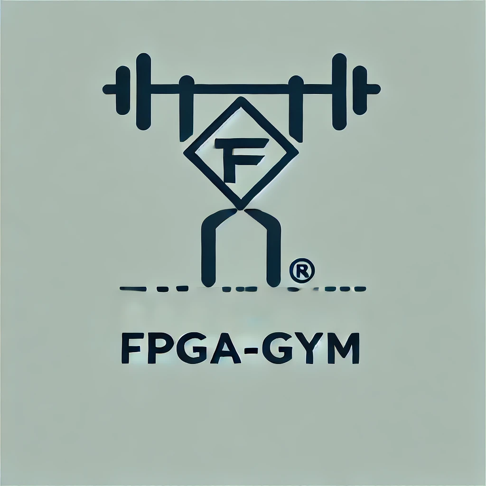
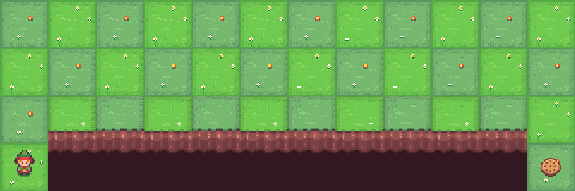

<h1 align="center">
<h1 align="center">Parallel Reinforcement Learning Environments on FPGA 🌍</h1>


[Introduction](#introduction) | [Environments](#environments) | [Template](#template) | [Quickstart](#quickstart)｜[Training Example](#training-example)｜[Other Great Tools](#other-great-tools) 

<table>
  <tr>
    <td></td>
    <td></td>
    <td></td>
    <td></td>
  </tr>
  <tr>
    <td></td>
    <td></td>
    <td></td>

  </tr>

</table>
## Introduction
💎 FPGA-Gym is the first diverse suite of scalable reinforcement learning environments based on FPGA technology.

It features very fast environment computation speed⚡️, large-scale parallelism🏅, and high flexibility🌊.

🏠 FPGA-Gym provides a template for parallel reinforcement learning environments on FPGA.
Its modular and parameterized features allow users to conveniently customize new environments without extensive FPGA knowledge.

🌌 It now features 7 environments based on this template!

## Environments
FPGA-Gym currently offers a variety of environments, including classical control, gridworld, and strategy games🌍. 
We are committed to continually expanding and enhancing the range of environments available.
| Environment                           | Category | Registered Version(s)                                           | Source  | Reference |
|---------------------------------------|----------|------------------------------------------------------------------|---------|-------------|
|  🍎 CartPole                            | Classic Control    | CartPole-v1                                                     | [code](#) | [Click](https://gymnasium.farama.org/environments/classic_control/cart_pole/)    |
| 🪵 Pendulum                       | Classic Control    | Pendulum-v1                                                | [code](#) | [Click](https://gymnasium.farama.org/environments/classic_control/pendulum/)    |
|  ⛰️MountainCar                       | Classic Control    | MountainCar-v0                                              | [code](#) | [Click](https://gymnasium.farama.org/environments/classic_control/mountain_car/)   
| 🧊 FrozenLake                        | gridworld    | FrozenLake-v1                                                  | [code](#) | [Click](https://gymnasium.farama.org/environments/toy_text/frozen_lake/)    |
|  🕳️ CliffWalking                          | gridworld    | CliffWalking-v0                | [code](#) | [Click](https://gymnasium.farama.org/environments/toy_text/cliff_walking/)    |
| 🚕 Taxi                             | gridworld    | Taxi-v3                                 | [code](#) | [Click](https://gymnasium.farama.org/environments/toy_text/taxi/)    |
|🃏 Blackjack                   | strategy games    | Blackjack-v1                                            | [code](#) | [Click](https://gymnasium.farama.org/environments/toy_text/blackjack/)    |


## Template
we provide the verilog template and python template, The hierarchical structure of the file is illustrated as follows:
* [`FPGA-Top.v`]() This file is just a wrapper.
    * [`Pipline.v`]() This file defines our carefully designed parallel template.
        * [`Compute.v`]() This file defines the number of hardware compute resources. 
            * [`Compute_Single.v`]() This file defines a single environment compute logic. This corresponds to a computational resource on the development board. If the user wants to add a new environment, they need to customize this file. We add CartPole as example in the template.
* [`FPGAEnv.py`]() This file defines the parent class. After inheriting the parent class, different environment son classes need to modify the main places as follows.
Please see the [User Guide]() for details on how to add your own environment to the template.

## Quickstart
If the environment you need is already available in the FPGA-Gym library, we provide a guide on ["How to Use the FPGA-Gym Library"](). 

If the environment you need is not available in the FPGA-Gym library, we provide instructions on ["How to Add New Environments Using the FPGA-Gym Template"]().

You can see an example in this [video](https://www.bilibili.com/video/BV12tV4e1EVw/?vd_source=3bfa69ca5962fd1ea8f48c880ae9844c).
File include:
1. VivadoProjectExample：
   You can download the environment's Vivado project in this [URL](https://disk.pku.edu.cn/link/AAA5847B47B5C84CFD987D4B0A803A7CC0).
   It includes
   the template Vivado project
   the CartPole, CliffWalking, Pendulum, Blackjack Vivado project
2. FPGAEnv(python code, use directly with training connections)

Preliminary software and hardware preparations:
1. An FPGA development board with PCIe
        Connect the FPGA development board with PCIe to the PCIe slot on the computer motherboard, just like the GPU.
2. PCIe driver: 
        Download the PCIe driver from [AMD's official website](https://support.xilinx.com/s/article/65444?language=en_US). 
        Follow the steps in the readme under the XDMA file.
3. Vivado software(A comprehensive design suite to turn our hardware behavior description language Verilog into the actual computing circuit inside the FPGA):
        Download the software Vivado from [AMD's official website](https://www.xilinx.com/support/download.html).
        We used version 2018.2 in our experiment, please open it with a later version of Vivado.

## Training Example
We provide examples of training, including [CartPole + DQN](), [CartPole + PPO](), [CliffWalking + DQN]().


## Other Great Tools

Other works have embraced the approach of writing RL environments in JAX. In particular, we suggest users check out the following sister repositories:


| Type                           | Name | Sources                                           | Introduction  | Paper |
|-------------------------------|--------------|------------------------------------------------------------------|---------|-------------|
|  CPU                         | 🍎 [VectorEnv](https://gymnasium.farama.org/api/vector/)  | CartPole-v1                                                     | the base class for vectorized environments to run multiple independent copies of the same environment in parallel. | [Click](https://gymnasium.farama.org/environments/classic_control/cart_pole/)    |
| 🪵 Pendulum                       | Classic Control    | Pendulum-v1                                                | [code](#) | [Click](https://gymnasium.farama.org/environments/classic_control/pendulum/)    |
|  ⛰️MountainCar                       | Classic Control    | MountainCar-v0                                              | [code](#) | [Click](https://gymnasium.farama.org/environments/classic_control/mountain_car/)   
| 🧊 FrozenLake                        | gridworld    | FrozenLake-v1                                                  | [code](#) | [Click](https://gymnasium.farama.org/environments/toy_text/frozen_lake/)    |
|  🕳️ CliffWalking                          | gridworld    | CliffWalking-v0                | [code](#) | [Click](https://gymnasium.farama.org/environments/toy_text/cliff_walking/)    |
| 🚕 Taxi                             | gridworld    | Taxi-v3                                 | [code](#) | [Click](https://gymnasium.farama.org/environments/toy_text/taxi/)    |
|🃏 Blackjack                   | strategy games    | Blackjack-v1                                            | [code](#) | [Click](https://gymnasium.farama.org/environments/toy_text/blackjack/)    |


[VectorEnv](https://gymnasium.farama.org/api/vector/) is the base class for vectorized environments to run multiple independent copies of the same environment in parallel.

[EnvPool](https://github.com/sail-sg/envpool) is a C++-based batched environment pool with pybind11 and thread pool.

[Sample Factory](https://github.com/alex-petrenko/sample-factory) is one of the fastest RL libraries focused on very efficient synchronous and asynchronous implementations of policy gradients (PPO)

[CuLE](https://github.com/NVlabs/cule) is a CUDA port of the Atari Learning Environment (ALE) and is designed to accelerate the development and evaluation of deep reinforcement algorithms using Atari games.

🏋️ [Gymnax]() implements classic environments including classic control, bsuite, MinAtar and a collection of meta RL tasks.

[Isaac Gym](https://github.com/isaac-sim/IsaacGymEnvs)

🦾 [Brax](https://github.com/google/brax) is a differentiable physics engine that simulates environments made up of rigid bodies, joints, and actuators.

🎲 [Pgx](https://github.com/sotetsuk/pgx) provides classic board game environments like Backgammon, Shogi, and Go.

[Craftax-Classic]

🕹️ [Jumanji](https://github.com/instadeepai/jumanji) provides a diverse range of environments ranging from simple games to NP-hard combinatorial problems.

[xland-minigrid]() provides Meta-RL gridworld environments in JAX inspired by MiniGrid and XLand.

[JaxMARL](https://github.com/FLAIROx/JaxMARL) supports a wide range of commonly used MARL environments. 

[Gigastep ](https://github.com/mlech26l/gigastep)

WrapDrive

Podracer


## Citation

You can cite FPGA-Gym as:

```bibtex
@misc{jiayili2024fpga-gym,
  title={FPGA-Gym: An FPGA-Accelerated Reinforcement Learning Environment Simulation Framework},
  author={Jiayi Li},
  year={2024},
  primaryClass={cs.LG},
  url={https://github.com/Selinaee/FPGA_Gym},
}